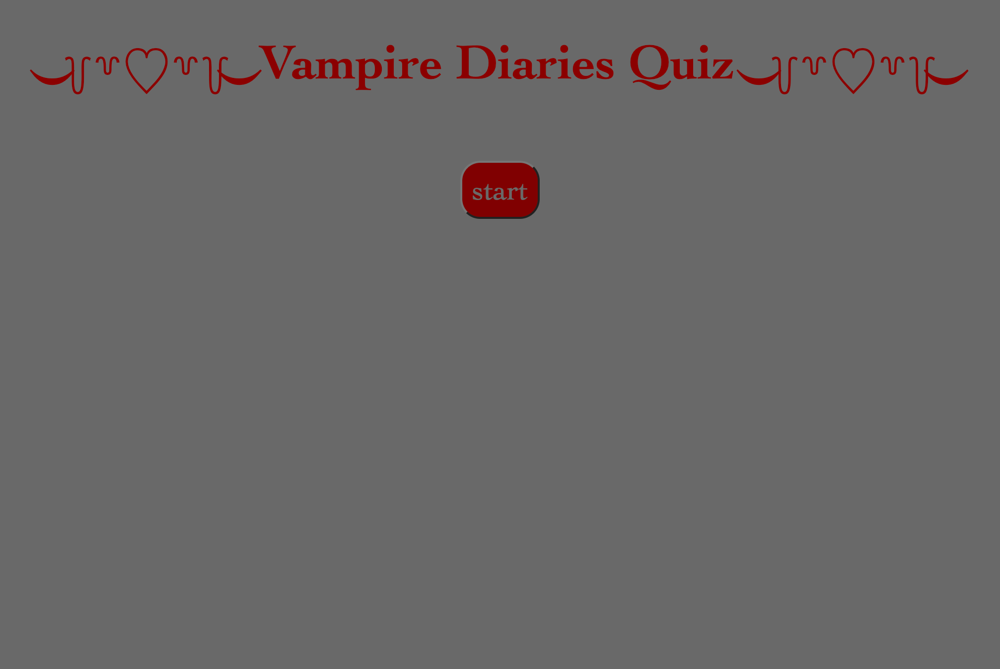

# vampire-diaries-quiz

## Description 
For this challenge we were asked to make a quiz, the quiz needed to have at timer, and be able to log a score when the question was correct.
This challenge was challenging because it took a lot of trial and error with the javascript. I think the biggest challenge for me was the question and answer elements in my project i had to do quite a bit of outside research to figure out how to right the questions and also how to make the answer be 'correct'. Another challenge was the local storage and I'm still unsure if I did that right.

## Installation
The first thing I did to complete this project was to write out all my questons and most of my variables and attatching them to classes and ID's in my HTML. next I added an event listener to the start button and wrote my first function being the start game function which I made sure to call future functions and that helped me map out how the rest of the quiz needed to be coded. Once all my funtions where coded I made the highscore page to show up once the last question was answered or once the timer reached 0. after I added the score to the local storage and on the 'score' part of the highscores card, that part was easy I struggled most with adding the initials and getting it to appear on the card, though once I figured it out it was actually quite easy. Throughout coding the javascript i was styling the CSS.

## Usage 
The application works but pressing the start button, once the start button is clicked you will be provided a question and the timer counts down from 60 seconds. To answer the questions you press the button answer you believe to be correct. If the answer you chose if indeed correct you will be provided the next question and you gain a point, if the answer you chose in incorrect you will lose 5 seconds on the timer and you will gain 0 points. Once all the questions are answered or the timer runs out you will be asked to input you initials and see you total points of correct answers, once you push submit it will log your initials and score to local storage.

link to deploys application:
https://heeyitsrissa.github.io/vampire-diaries-quiz/

screenshot of deployed application:

## License

